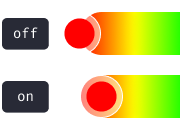

# ColorPicker Wrapper

- The `ColorPicker` Wrapper is responsible for managing the built-in components.

:::caution

All built-in components should be wrapped within the `ColorPicker` component.

:::

- You can nest components within the `ColorPicker` wrapper to achieve the desired level of customization.

```jsx
<ColorPicker>
  <Preview />

  <View>
    <Panel1 />
    <HueSlider vertical />
  </View>

  <View>
    <Text>Opacity</Text>
    <OpacitySlider />
  </View>

  <Swatches />
</ColorPicker>
```

## Props

### `value`

- The initial color that should be displayed when the `ColorPicker` is loaded.
- If the `value` property is modified, the `ColorPicker` will automatically update the displayed color.
- Accepts: `'hex' | 'rgb' | 'rgba' | 'hsl' | 'hsla' | 'hsv' | 'hsva' | 'hwb' | 'hwba' | named colors` formats.
- `type: string`
- `default: '#418181'`

### `boundedThumb`



- A global property for all descendant sliders and panels components.
- Determines whether the slider thumb (or handle) should be constrained to stay within the boundaries of the slider.
- When set to `true`, the thumb will not be allowed to move beyond the edges of the slider.
- When set to `false`, part of it will be outside of the slider bounds.
- `type: boolean`
- `default: false`

### `sliderThickness`

- A global property that allows for changing the thickness of all descendant slider components.
- The thickness refers to the `width` of the slider in the case of a `vertical` orientation, and the `height` in the case of a `horizontal` orientation.
- `type: number`
- `default: 25`

### `thumbAnimationDuration`

- A global property to change the duration which the thumbs animate when the value prop changes.
- `type: number`
- `default: 200`

### `thumbSize`

- A global property for changing the thumb size of all descendant slider components.
- `type: number`
- `default: 35`

### `thumbColor`

- A global property for changing the thumb color of all descendant slider components.
- `type: string`
- `default: undefined`

### `thumbShape`

- A global property that allows for the alteration of the thumb shape and appearance of all descendant slider components.
- `type: string`
- `default: 'ring'`
- `values:`<shapes/>

### `thumbStyle`

- A global property to change the style of the thumb's View for all descendant sliders components.
- `type: ViewStyle`

### `thumbInnerStyle`

- A global property to change the color of the thumb's inner View(s) for all descendant sliders components.
- `type: ViewStyle`

### `renderThumb`

- A global property for using the same custom thumb for all descendant slider components.
- Function which receives `ThumbProps` and returns a custom thumb component.
- Overrides `thumbShape`

#### `ThumbProps`

|      Prop       |         Type          | Description                                                                                       |
| :-------------: | :-------------------: | :------------------------------------------------------------------------------------------------ |
| `positionStyle` |      `StyleProp`      | This style determines the position of the thumb and is a crucial element that should be included. |
|     `width`     |       `number`        | Extracted from the `thumbSize` prop and it's important for thumb position calculation.            |
|    `height`     |       `number`        | Extracted from the `thumbSize` prop and it's important for thumb position calculation.            |
| `adaptiveColor` | `SharedValue<string>` | White or black based on the contrast ratio.                                                       |
| `currentColor`  | `SharedValue<string>` | This shared value will update whenever the color changes.                                         |
| `initialColor`  |       `string`        | The initial color value as a `string`.                                                            |

- Example Usage:

```jsx
import Animated, { useAnimatedStyle } from 'react-native-reanimated';
import type { RenderThumbProps } from 'reanimated-color-picker';

function MyCustomThumb({
  width,
  height,
  positionStyle,
  adaptiveColor,
  currentColor,
  initialColor,
}: RenderThumbProps) {

  const animatedStyle = useAnimatedStyle(() => ({
    borderColor: adaptiveColor.value,
    backgroundColor: currentColor.value,
  }));

  return (
    <Animated.View
      style={[
        { width, height, borderWidth: 1, borderRadius: width / 2, overflow: 'hidden' },
        animatedStyle,
        positionStyle,
        ]}
    >
      <View style={{ backgroundColor: initialColor, width: '50%', height, alignSelf: 'flex-end' }} />
    </Animated.View>
  );
}
```

### `style`

- The container style of the `ColorPicker`.
- `type: ViewStyle`

:::info note

- Certain style properties will be overridden.

:::

### `onChange`

- Triggers every time the user modifies the color.
- The passed color object has the following properties: `hex`, `rgb`, `rgba`, `hsv`, `hsva`, `hwb`, `hwba`, `hsl`, and `hsla`
- `type: (color: object) => void`
- `default: null`

:::tip

- To prevent performance issues, it is best to avoid using `setState` in the `onChange` callback.
- It is highly recommended to utilize the `useSharedValue` function from the `react-native-reanimated` library.

:::

### `onComplete`

- Triggered upon the user releasing the slider handle or clicking on a swatch.
- The passed color object has the following properties: `hex`, `rgb`, `rgba`, `hsv`, `hsva`, `hwb`, `hwba`, `hsl`, and `hsla`
- `type: (color: object) => void`
- `default: null`
